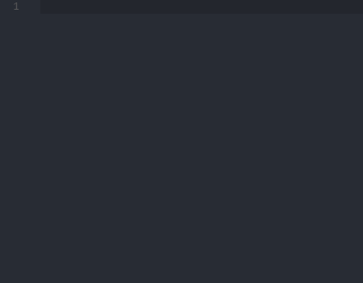

# JSON Snippets for Visual Studio Code
A simple set of snippets that makes writing JSON easier.

| Snippets | Content |
| -------: | --------|
| obj | Create a JSON object |
| arr | Create a JSON array |
| pair | Create JSON key/value pair |
| pairc | Create JSON key/value pair ending with comma.\nRecommended for nested objects |
| paircln | Create JSON key/value pair ending with comma and jumping to next line.\nNot recommended for nested objects |
| valc | Create JSON value element ending withy comma |

